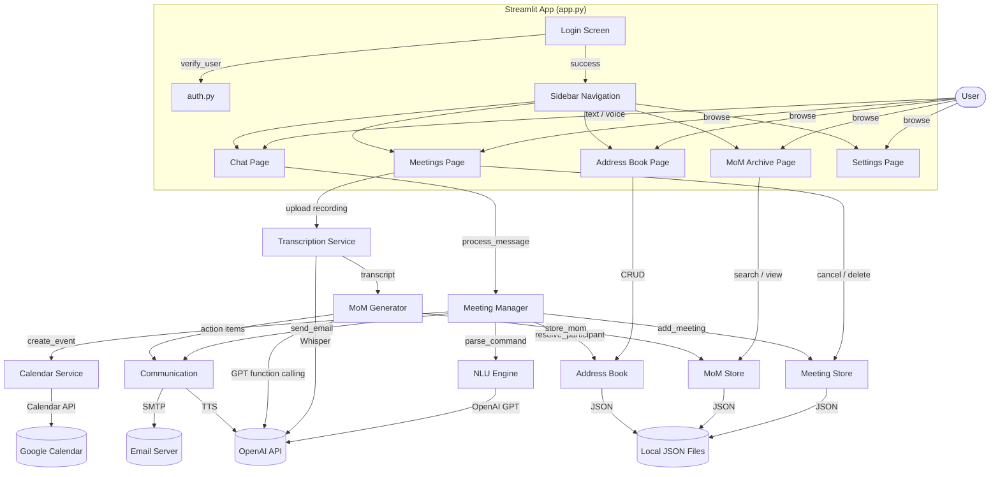
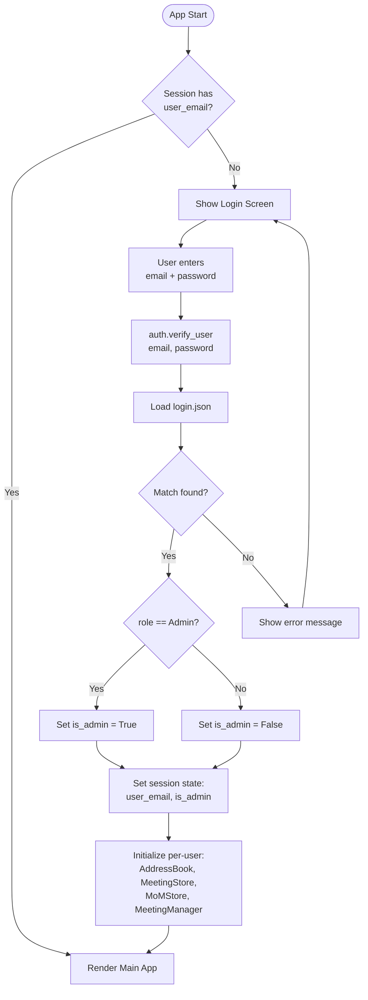
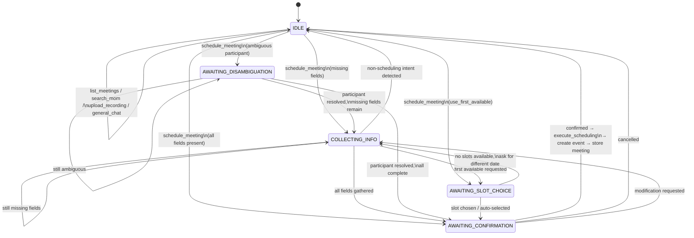
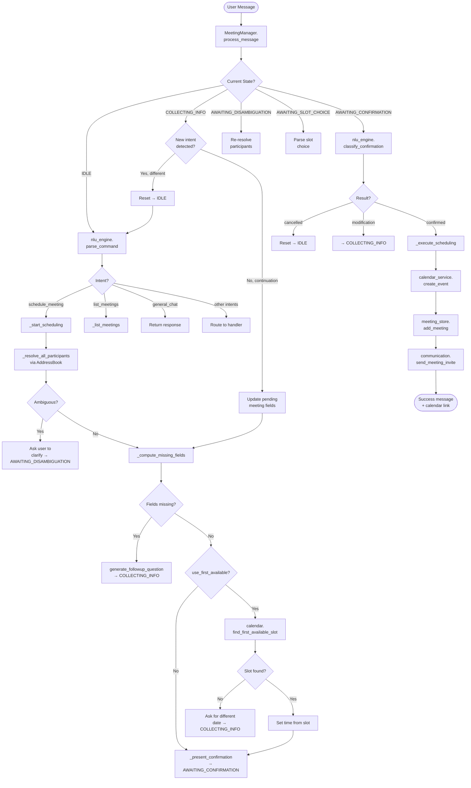
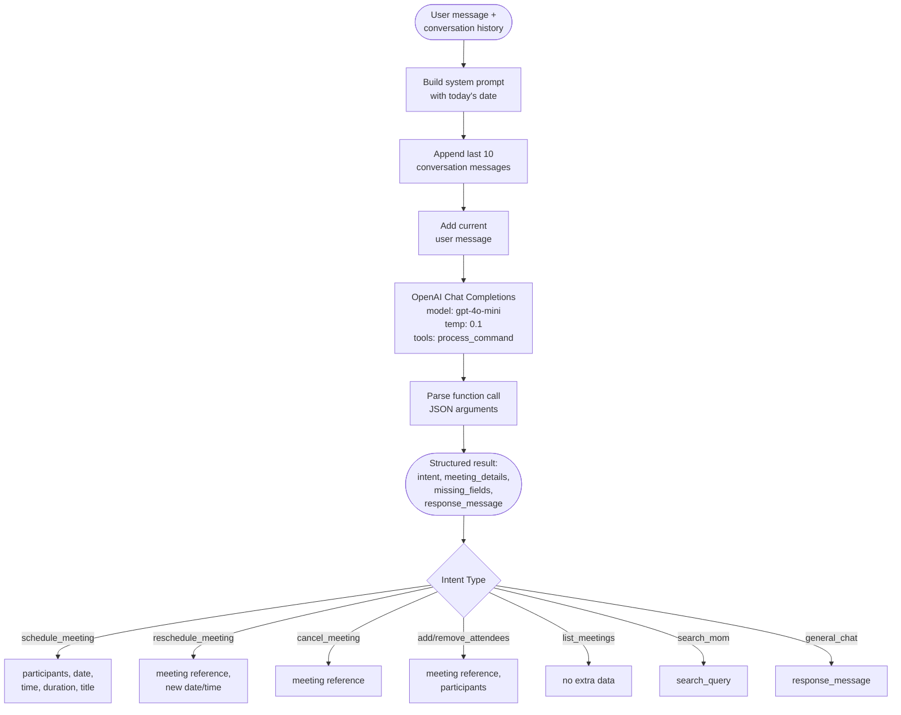
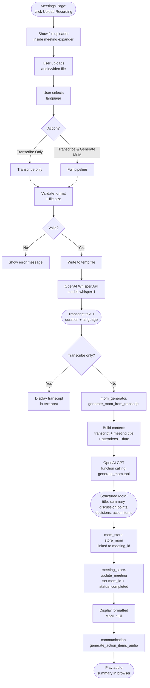
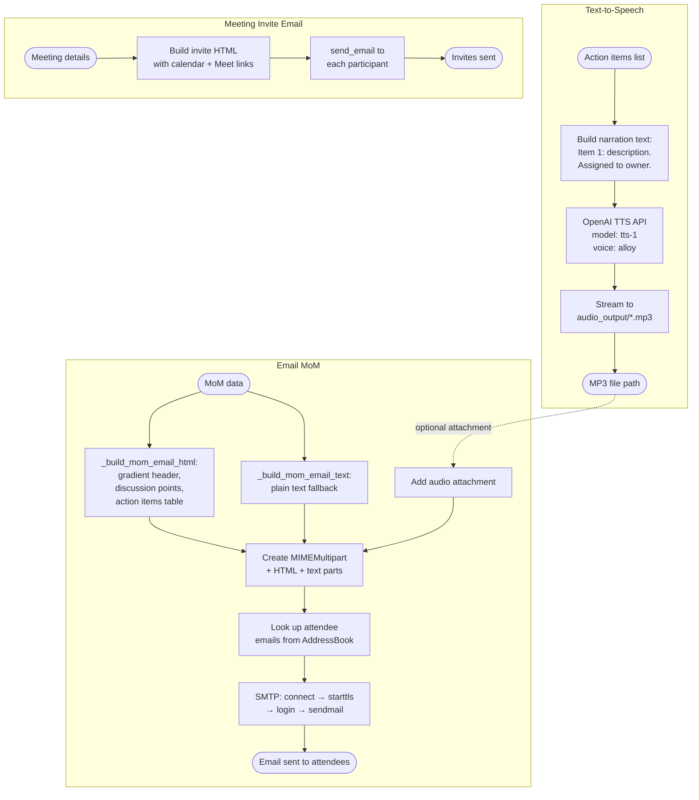
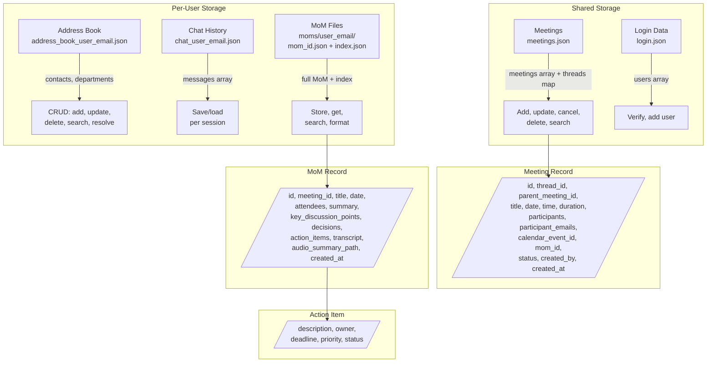
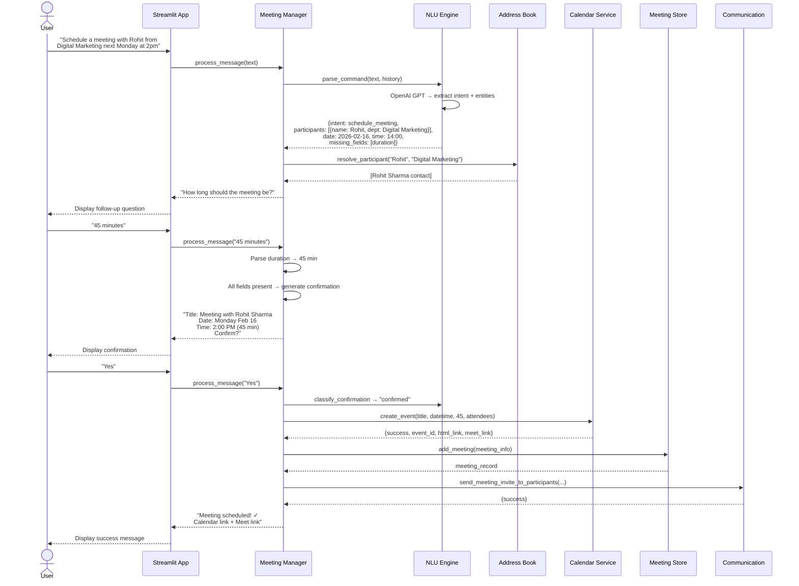

# Smart Office Assistant — Mermaid Flow Diagrams

Copy any diagram below into a Mermaid-compatible renderer
(e.g. [mermaid.live](https://mermaid.live), GitHub markdown, VS Code Mermaid plugin).

---

## 1. Application High-Level Architecture

---

## 2. Authentication Flow

---

## 3. Meeting Scheduling — Conversation State Machine

---

## 4. Meeting Scheduling — Detailed Execution Flow

---

## 5. NLU Engine — Command Parsing Flow

---

## 6. Recording Upload & MoM Generation Flow

---

## 7. Communication Flow — TTS & Email

---

## 8. Data Storage Architecture

---

## 9. Calendar Service Flow

```mermaid
flowchart TD
    subgraph "Authentication"
        Start([Initialize]) --> CheckLib{Google API\nlibraries installed?}
        CheckLib -->|No| MockMode[Use MockCalendarService]
        CheckLib -->|Yes| CheckCreds{credentials.json\nexists?}
        CheckCreds -->|No| MockMode
        CheckCreds -->|Yes| CheckToken{token.json\nexists & valid?}
        CheckToken -->|Yes| BuildService[Build Calendar\nservice v3]
        CheckToken -->|No, expired| Refresh[Refresh token]
        CheckToken -->|No, missing| OAuthFlow[OAuth2 browser\nconsent flow]
        Refresh --> SaveToken[Save token.json]
        OAuthFlow --> SaveToken
        SaveToken --> BuildService
        BuildService --> Ready([Calendar Ready])
    end

    subgraph "Create Event"
        EventInput([title, datetime,\nduration, attendees]) --> BuildBody[Build event body:\nstart/end, timezone IST,\nreminders, attendees,\nconferenceData for Meet]
        BuildBody --> InsertAPI[events.insert API\nsendUpdates: all]
        InsertAPI --> EventResult([event_id, html_link,\nmeet_link])
    end

    subgraph "Check Availability"
        DateInput([target date,\nduration]) --> FreeBusy[freebusy.query API\n9 AM - 6 PM IST]
        FreeBusy --> BusyPeriods[Parse busy periods]
        BusyPeriods --> GenSlots[Generate 30-min\nincrement slots]
        GenSlots --> FilterSlots[Remove slots\noverlapping busy]
        FilterSlots --> AvailSlots([Available slots\nlist])
    end
```

---

## 10. End-to-End: Schedule a Meeting

---

*Use these diagrams at [mermaid.live](https://mermaid.live) or any Mermaid-compatible renderer.*
